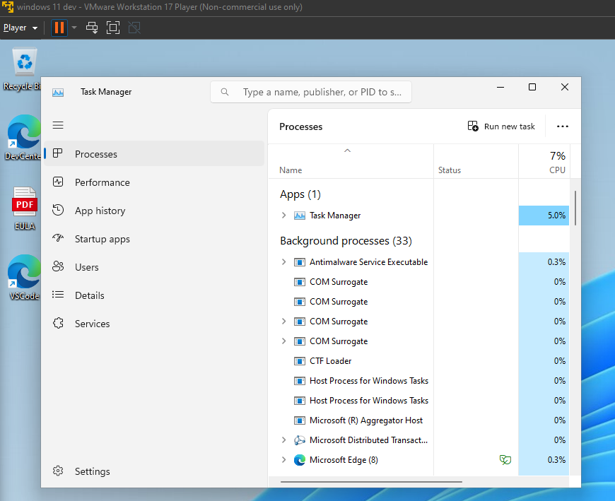
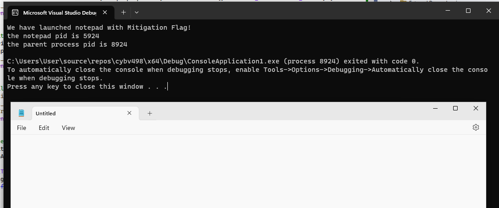
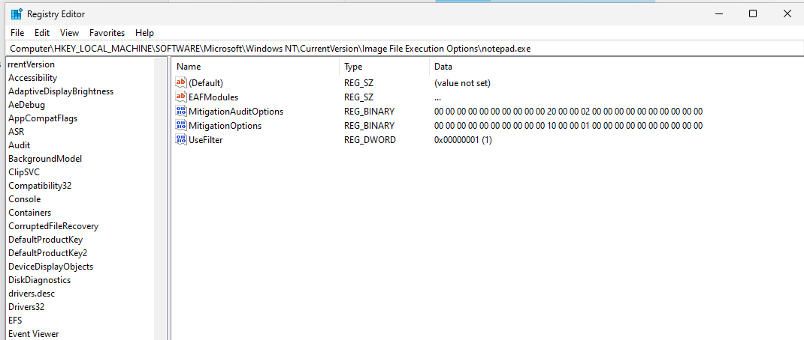

# Code examples for final project

- Multiple ways to set Process Mitigations
- Win API way is to use `SetProcessMitigationPolicy` which takes one of the following enums

```cpp
typedef enum _PROCESS_MITIGATION_POLICY {
    ProcessDEPPolicy,
    ProcessASLRPolicy,
    ProcessDynamicCodePolicy,
    ProcessStrictHandleCheckPolicy,
    ProcessSystemCallDisablePolicy,
    ProcessMitigationOptionsMask,
    ProcessExtensionPointDisablePolicy,
    ProcessControlFlowGuardPolicy,
    ProcessSignaturePolicy,
    ProcessFontDisablePolicy,
    ProcessImageLoadPolicy,
    ProcessSystemCallFilterPolicy,
    ProcessPayloadRestrictionPolicy,
    ProcessChildProcessPolicy,
    ProcessSideChannelIsolationPolicy,
    ProcessUserShadowStackPolicy,
    ProcessRedirectionTrustPolicy,
    ProcessUserPointerAuthPolicy,
	ProcessSEHOPPolicy,
    MaxProcessMitigationPolicy
} PROCESS_MITIGATION_POLICY, *PPROCESS_MITIGATION_POLICY;

```

- Powershell Set-Mitigation 

- Directly set bits (hacky)

```cpp
#define PROCESS_CREATION_MITIGATION_POLICY_FONT_DISABLE_ALWAYS_ON                         (0x00000001ui64 << 48)
#define PROCESS_CREATION_MITIGATION_POLICY_CONTROL_FLOW_GUARD_ALWAYS_ON                   (0x00000001ui64 << 40)
```

```python
hex(0x00000001 << 48 | 0x00000001 << 40)
>>> '0x1010000001000'
```

```cpp
0: kd> dx -r1 @$cursession.Processes[11996].KernelObject.MitigationFlagsValues
@$cursession.Processes[11996].KernelObject.MitigationFlagsValues                 [Type: <unnamed-tag>]
    [+0x000 ( 0: 0)] ControlFlowGuardEnabled : 0x1 [Type: unsigned long]
    [+0x000 ( 1: 1)] ControlFlowGuardExportSuppressionEnabled : 0x0 [Type: unsigned long]
    [+0x000 ( 2: 2)] ControlFlowGuardStrict : 0x0 [Type: unsigned long]
    [+0x000 ( 3: 3)] DisallowStrippedImages : 0x0 [Type: unsigned long]
    [+0x000 ( 4: 4)] ForceRelocateImages : 0x0 [Type: unsigned long]
    [+0x000 ( 5: 5)] HighEntropyASLREnabled : 0x1 [Type: unsigned long]
    [+0x000 ( 6: 6)] StackRandomizationDisabled : 0x0 [Type: unsigned long]
    [+0x000 ( 7: 7)] ExtensionPointDisable : 0x0 [Type: unsigned long]
    [+0x000 ( 8: 8)] DisableDynamicCode : 0x0 [Type: unsigned long]
    [+0x000 ( 9: 9)] DisableDynamicCodeAllowOptOut : 0x0 [Type: unsigned long]
    [+0x000 (10:10)] DisableDynamicCodeAllowRemoteDowngrade : 0x0 [Type: unsigned long]
    [+0x000 (11:11)] AuditDisableDynamicCode : 0x0 [Type: unsigned long]
    [+0x000 (12:12)] DisallowWin32kSystemCalls : 0x0 [Type: unsigned long]
    [+0x000 (13:13)] AuditDisallowWin32kSystemCalls : 0x0 [Type: unsigned long]
    [+0x000 (14:14)] EnableFilteredWin32kAPIs : 0x0 [Type: unsigned long]
    [+0x000 (15:15)] AuditFilteredWin32kAPIs : 0x0 [Type: unsigned long]
    [+0x000 (16:16)] DisableNonSystemFonts : 0x1 [Type: unsigned long]
    [+0x000 (17:17)] AuditNonSystemFontLoading : 0x0 [Type: unsigned long]
    [+0x000 (18:18)] PreferSystem32Images : 0x0 [Type: unsigned long]
    [+0x000 (19:19)] ProhibitRemoteImageMap : 0x0 [Type: unsigned long]
    [+0x000 (20:20)] AuditProhibitRemoteImageMap : 0x0 [Type: unsigned long]
    [+0x000 (21:21)] ProhibitLowILImageMap : 0x0 [Type: unsigned long]
    [+0x000 (22:22)] AuditProhibitLowILImageMap : 0x0 [Type: unsigned long]
    [+0x000 (23:23)] SignatureMitigationOptIn : 0x0 [Type: unsigned long]
    [+0x000 (24:24)] AuditBlockNonMicrosoftBinaries : 0x0 [Type: unsigned long]
    [+0x000 (25:25)] AuditBlockNonMicrosoftBinariesAllowStore : 0x0 [Type: unsigned long]
    [+0x000 (26:26)] LoaderIntegrityContinuityEnabled : 0x0 [Type: unsigned long]
    [+0x000 (27:27)] AuditLoaderIntegrityContinuity : 0x0 [Type: unsigned long]
    [+0x000 (28:28)] EnableModuleTamperingProtection : 0x0 [Type: unsigned long]
    [+0x000 (29:29)] EnableModuleTamperingProtectionNoInherit : 0x0 [Type: unsigned long]
    [+0x000 (30:30)] RestrictIndirectBranchPrediction : 0x0 [Type: unsigned long]
    [+0x000 (31:31)] IsolateSecurityDomain : 0x0 [Type: unsigned long]
```

- Set with UpdateProcThread

- Windbg dx query to sjpw current processes with a protected type. Protected Light processes can access ELAM

```cpp
0: kd> dx -g @$protected.Select(p => new {Name = p.Name, Type = (nt!_PS_PROTECTED_TYPE)p.KernelObject.Protection.Type, Signer = (nt!_PS_PROTECTED_SIGNER)p.KernelObject.Protection.Signer})

===========================================================================================================================
=             = Name                         = Type                                 = Signer                              =
===========================================================================================================================
= [0x4]       - System                       - PsProtectedTypeProtected (2)         - PsProtectedSignerWinSystem (7)      =
= [0x6c]      - Registry                     - PsProtectedTypeProtected (2)         - PsProtectedSignerWinSystem (7)      =
= [0x18c]     - smss.exe                     - PsProtectedTypeProtectedLight (1)    - PsProtectedSignerWinTcb (6)         =
= [0x224]     - csrss.exe                    - PsProtectedTypeProtectedLight (1)    - PsProtectedSignerWinTcb (6)         =
= [0x288]     - wininit.exe                  - PsProtectedTypeProtectedLight (1)    - PsProtectedSignerWinTcb (6)         =
= [0x290]     - csrss.exe                    - PsProtectedTypeProtectedLight (1)    - PsProtectedSignerWinTcb (6)         =
= [0x31c]     - services.exe                 - PsProtectedTypeProtectedLight (1)    - PsProtectedSignerWinTcb (6)         =
= [0x334]     - lsass.exe                    - PsProtectedTypeNone (0)              - PsProtectedSignerNone (0)           =
= [0x7a8]     - MemCompression               - PsProtectedTypeProtected (2)         - PsProtectedSignerWinSystem (7)      =
= [0xc84]     - MsMpEng.exe                  - PsProtectedTypeProtectedLight (1)    - PsProtectedSignerAntimalware (3)    =
= [0x12f8]    - svchost.exe                  - PsProtectedTypeProtectedLight (1)    - PsProtectedSignerWindows (5)        =
= [0x1a64]    - NisSrv.exe                   - PsProtectedTypeProtectedLight (1)    - PsProtectedSignerAntimalware (3)    =
= [0x1bfc]    - SecurityHealthService.exe    - PsProtectedTypeProtectedLight (1)    - PsProtectedSignerWindows (5)        =
===========================================================================================================================
```

- Running this dx query in windbg shows us that currently there are no processes with EnableModuleTamperingProtection

```cpp
0: kd> dx -r1 @$cursession.Processes.Where(p => p.KernelObject.MitigationFlagsValues.EnableModuleTamperingProtection)
@$cursession.Processes.Where(p => p.KernelObject.MitigationFlagsValues.EnableModuleTamperingProtection)                
    [0x2520]         : SystemSettingsAdminFlows.exe [Switch To]
    [0x33dc]         : mmc.exe [Switch To]
    [0x1c4c]         : Taskmgr.exe [Switch To]

```

- Start taskmgr a known process with EnableModuleTamperingProtection


```cpp
0: kd> dx @$cursession.Processes.Where(p => p.KernelObject.MitigationFlagsValues.EnableModuleTamperingProtection)
@$cursession.Processes.Where(p => p.KernelObject.MitigationFlagsValues.EnableModuleTamperingProtection)                
    [0x2154]         : Taskmgr.exe [Switch To]
```


```cpp
dx @$taskmgr =  (*((ntkrnlmp!_EPROCESS *)0xffffbf0daea130c0))
```

- Drilling down we can see further mitigation flags

```cpp
[+0x9d0] MitigationFlagsValues [Type: <unnamed-tag>]
[+0x9d4] MitigationFlags2Values [Type: <unnamed-tag>]
[+0xb70] MitigationFlags3Values [Type: <unnamed-tag>]
```

- MitagationFlagsValue

```cpp
[+0x000 ( 0: 0)] ControlFlowGuardEnabled : 0x1 [Type: unsigned long]
[+0x000 ( 5: 5)] HighEntropyASLREnabled : 0x1 [Type: unsigned long]
[+0x000 (26:26)] LoaderIntegrityContinuityEnabled : 0x1 [Type: unsigned long]
[+0x000 (27:27)] AuditLoaderIntegrityContinuity : 0x1 [Type: unsigned long]
[+0x000 (28:28)] EnableModuleTamperingProtection : 0x1 [Type: unsigned long]
```

```cpp
#include <Windows.h>
#include <iostream>

void print_error(std::string function) {
    DWORD errorCode = GetLastError();
    LPWSTR errorMessage = NULL;
    FormatMessage(FORMAT_MESSAGE_ALLOCATE_BUFFER | FORMAT_MESSAGE_FROM_SYSTEM | FORMAT_MESSAGE_IGNORE_INSERTS,
        NULL,
        errorCode,
        MAKELANGID(LANG_NEUTRAL, SUBLANG_DEFAULT),
        (LPWSTR)&errorMessage,
        0,
        NULL);

    // Print the error message
    std::wcout << function.c_str() <<
        " ERROR CODE - " << errorCode
        << L": " << errorMessage << std::endl;
}

int main()
{


    // Set up the STARTUPINFOW and PROCESS_INFORMATION structures
    STARTUPINFOEX si = { sizeof(si) };
    PROCESS_INFORMATION pi;
    // Set up the attribute list
    SIZE_T size = 0;
    si.lpAttributeList = NULL;


    // Set the mitigation flags
    DWORD64 mitigationFlags =
        PROCESS_CREATION_MITIGATION_POLICY_FONT_DISABLE_ALWAYS_ON;

    // Get the required size for the attribute list
    if (!InitializeProcThreadAttributeList(NULL, 1, 0, &size) && GetLastError() != ERROR_INSUFFICIENT_BUFFER) {
        print_error("Failed to get attribute list size");
        return 1;
    }

    // Allocate memory for the attribute list
    si.lpAttributeList = (LPPROC_THREAD_ATTRIBUTE_LIST)HeapAlloc(GetProcessHeap(), 0, size);
    if (!si.lpAttributeList) {
        print_error("Failed to allocate attribute list");
        return 1;
    }

    // Initialize the attribute list
    if (!InitializeProcThreadAttributeList(si.lpAttributeList, 1, 0, &size)) {
        print_error("Failed to initialize attribute list 1");
        HeapFree(GetProcessHeap(), 0, si.lpAttributeList);
        return 1;
    }

    // Add the mitigation policy to the attribute list
    if (!UpdateProcThreadAttribute(
        si.lpAttributeList, 
        0, 
        PROC_THREAD_ATTRIBUTE_MITIGATION_POLICY, 
        &mitigationFlags, 
        sizeof(mitigationFlags), 
        NULL, 
        NULL) 
        )
    {
        print_error("Failed to update attribute list");
        DeleteProcThreadAttributeList(si.lpAttributeList);
        HeapFree(GetProcessHeap(), 0, si.lpAttributeList);
        return 1;
    }

    // The application path, for example, notepad.exe
    wchar_t application[] = L"notepad.exe";

    // Create the process
    if (!CreateProcessW(
        NULL,
        application,
        NULL,
        NULL,
        FALSE,
        EXTENDED_STARTUPINFO_PRESENT,
        NULL,
        NULL,
        &si.StartupInfo,
        &pi)
    )
    {
        print_error("Failed to create process");
        DeleteProcThreadAttributeList(reinterpret_cast<LPPROC_THREAD_ATTRIBUTE_LIST>(si.lpAttributeList));
        HeapFree(GetProcessHeap(), 0, si.lpAttributeList);
        return 1;
    }
    std::cout << "We have launched notepad with Mitigation Flag!\n";
    std::cout << "the notepad pid is " << pi.dwProcessId << '\n';
    std::cout << "the parent process pid is " << GetCurrentProcessId() << '\n';
}

```

- Code found in `WinBase.h` header file

```cpp
// Define the module tampering mitigation policy options.
//

#define PROCESS_CREATION_MITIGATION_POLICY2_MODULE_TAMPERING_PROTECTION_MASK              (0x00000003ui64 << 12)
#define PROCESS_CREATION_MITIGATION_POLICY2_MODULE_TAMPERING_PROTECTION_DEFER             (0x00000000ui64 << 12)
#define PROCESS_CREATION_MITIGATION_POLICY2_MODULE_TAMPERING_PROTECTION_ALWAYS_ON         (0x00000001ui64 << 12)
#define PROCESS_CREATION_MITIGATION_POLICY2_MODULE_TAMPERING_PROTECTION_ALWAYS_OFF        (0x00000002ui64 << 12)
#define PROCESS_CREATION_MITIGATION_POLICY2_MODULE_TAMPERING_PROTECTION_NOINHERIT         (0x00000003ui64 << 12)

//
```

- Start taskmgr a known process with EnableModuleTamperingProtection


```cpp
0: kd> dx -r1 @$cursession.Processes[5924].KernelObject.MitigationFlagsValues
@$cursession.Processes[5924].KernelObject.MitigationFlagsValues                 [Type: <unnamed-tag>]
    [+0x000 ( 0: 0)] ControlFlowGuardEnabled : 0x0 [Type: unsigned long]
    [+0x000 ( 1: 1)] ControlFlowGuardExportSuppressionEnabled : 0x0 [Type: unsigned long]
    [+0x000 ( 2: 2)] ControlFlowGuardStrict : 0x0 [Type: unsigned long]
    [+0x000 ( 3: 3)] DisallowStrippedImages : 0x0 [Type: unsigned long]
    [+0x000 ( 4: 4)] ForceRelocateImages : 0x0 [Type: unsigned long]
    [+0x000 ( 5: 5)] HighEntropyASLREnabled : 0x1 [Type: unsigned long]
    [+0x000 ( 6: 6)] StackRandomizationDisabled : 0x0 [Type: unsigned long]
    [+0x000 ( 7: 7)] ExtensionPointDisable : 0x0 [Type: unsigned long]
    [+0x000 ( 8: 8)] DisableDynamicCode : 0x0 [Type: unsigned long]
    [+0x000 ( 9: 9)] DisableDynamicCodeAllowOptOut : 0x0 [Type: unsigned long]
    [+0x000 (10:10)] DisableDynamicCodeAllowRemoteDowngrade : 0x0 [Type: unsigned long]
    [+0x000 (11:11)] AuditDisableDynamicCode : 0x0 [Type: unsigned long]
    [+0x000 (12:12)] DisallowWin32kSystemCalls : 0x0 [Type: unsigned long]
    [+0x000 (13:13)] AuditDisallowWin32kSystemCalls : 0x0 [Type: unsigned long]
    [+0x000 (14:14)] EnableFilteredWin32kAPIs : 0x0 [Type: unsigned long]
    [+0x000 (15:15)] AuditFilteredWin32kAPIs : 0x0 [Type: unsigned long]
    [+0x000 (16:16)] DisableNonSystemFonts : 0x1 [Type: unsigned long]
    [+0x000 (17:17)] AuditNonSystemFontLoading : 0x0 [Type: unsigned long]
    [+0x000 (18:18)] PreferSystem32Images : 0x0 [Type: unsigned long]
    [+0x000 (19:19)] ProhibitRemoteImageMap : 0x0 [Type: unsigned long]
    [+0x000 (20:20)] AuditProhibitRemoteImageMap : 0x0 [Type: unsigned long]
    [+0x000 (21:21)] ProhibitLowILImageMap : 0x0 [Type: unsigned long]
    [+0x000 (22:22)] AuditProhibitLowILImageMap : 0x0 [Type: unsigned long]
    [+0x000 (23:23)] SignatureMitigationOptIn : 0x0 [Type: unsigned long]
    [+0x000 (24:24)] AuditBlockNonMicrosoftBinaries : 0x0 [Type: unsigned long]
    [+0x000 (25:25)] AuditBlockNonMicrosoftBinariesAllowStore : 0x0 [Type: unsigned long]
    [+0x000 (26:26)] LoaderIntegrityContinuityEnabled : 0x0 [Type: unsigned long]
    [+0x000 (27:27)] AuditLoaderIntegrityContinuity : 0x0 [Type: unsigned long]
    [+0x000 (28:28)] EnableModuleTamperingProtection : 0x0 [Type: unsigned long]
    [+0x000 (29:29)] EnableModuleTamperingProtectionNoInherit : 0x0 [Type: unsigned long]
    [+0x000 (30:30)] RestrictIndirectBranchPrediction : 0x0 [Type: unsigned long]
    [+0x000 (31:31)] IsolateSecurityDomain : 0x0 [Type: unsigned long]
```

- Computer\HKEY_LOCAL_MACHINE\SOFTWARE\Microsoft\PolicyManager\default\ADMX_GroupPolicy\FontMitigation
- Computer\HKEY_LOCAL_MACHINE\SOFTWARE\Microsoft\Windows NT\CurrentVersion\Image File Execution Options\notepad.exe

- random links
- https://stackoverflow.com/questions/67141766/pe-injection-fails-if-injector-gets-launched-by-specific-application
- https://learn.microsoft.com/en-us/windows/win32/api/processthreadsapi/nf-processthreadsapi-setprocessmitigationpolicy

- Attempting to set the MitigationFlag with powershell leads to error

```ps
Set-ProcessMitigation -Name "notepad.exe" -Enable EnableModuleTamperingProtection
Set-ProcessMitigation : Cannot validate argument on parameter 'Enable'. The argument "EnableModuleTamperingProtection"
does not belong to the set "DEP,EmulateAtlThunks,ForceRelocateImages,RequireInfo,BottomUp,HighEntropy,StrictHandle,Disa
bleWin32kSystemCalls,AuditSystemCall,DisableExtensionPoints,BlockDynamicCode,AllowThreadsToOptOut,AuditDynamicCode,CFG,
SuppressExports,StrictCFG,MicrosoftSignedOnly,AllowStoreSignedBinaries,AuditMicrosoftSigned,AuditStoreSigned,EnforceMod
uleDependencySigning,DisableNonSystemFonts,AuditFont,BlockRemoteImageLoads,BlockLowLabelImageLoads,PreferSystem32,Audit
RemoteImageLoads,AuditLowLabelImageLoads,AuditPreferSystem32,EnableExportAddressFilter,AuditEnableExportAddressFilter,E
nableExportAddressFilterPlus,AuditEnableExportAddressFilterPlus,EnableImportAddressFilter,AuditEnableImportAddressFilte
r,EnableRopStackPivot,AuditEnableRopStackPivot,EnableRopCallerCheck,AuditEnableRopCallerCheck,EnableRopSimExec,AuditEna
bleRopSimExec,SEHOP,AuditSEHOP,SEHOPTelemetry,TerminateOnError,DisallowChildProcessCreation,AuditChildProcess,UserShado
wStack,UserShadowStackStrictMode,AuditUserShadowStack"
```

- UAC foodhelper 
- https://pentestlab.blog/2017/06/07/uac-bypass-fodhelper/
- https://stackoverflow.com/questions/67141766/pe-injection-fails-if-injector-gets-launched-by-specific-application
- https://admx.help/?Category=Windows_10_2016&Policy=Microsoft.Policies.GroupPolicy::ProcessMitigationOptions
- https://learn.microsoft.com/en-us/windows/security/threat-protection/override-mitigation-options-for-app-related-security-policies


- Struct for IMAGE_SECTION_HEADER
- https://learn.microsoft.com/en-us/windows/win32/api/dbghelp/nf-dbghelp-imagedirectoryentrytodataex
```cpp
typedef struct _IMAGE_SECTION_HEADER {
    BYTE Name[IMAGE_SIZEOF_SHORT_NAME];
    union {
        DWORD PhysicalAddress;
        DWORD VirtualSize;
    } Misc;
    DWORD VirtualAddress;
    DWORD SizeOfRawData;
    DWORD PointerToRawData;
    DWORD PointerToRelocations;
    DWORD PointerToLinenumbers;
    WORD NumberOfRelocations;
    WORD NumberOfLinenumbers;
    DWORD Characteristics;
} IMAGE_SECTION_HEADER, *PIMAGE_SECTION_HEADER;
```
